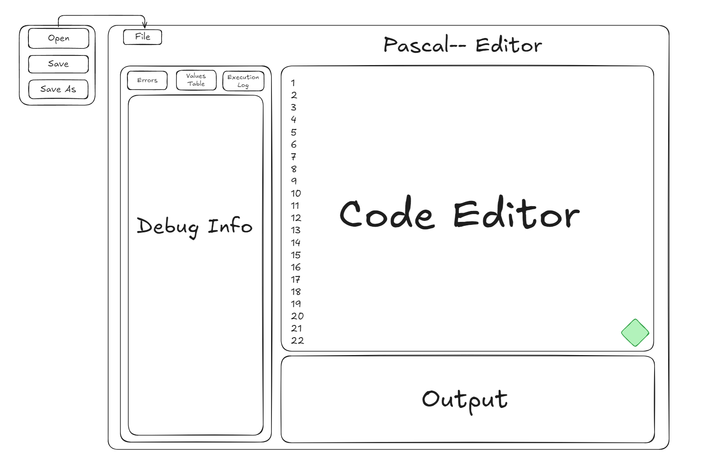

## Разработчики

- Дорофеев Иван - 4elodoy-Molovek
- Кутузов Иван - AkarFire
- Лузан Егор - smallAbyss

## Основная информация

#### Цель
Разработка интегрированной среды разработки (IDE) для языка программирования Pascal--. Среда должна предоставлять возможности создания, редактирования, выполнения и отладки программ, написанных на упрощённой версии языка Pascal--.
#### Основная информация
Требуется разработать графическое приложение, позволяющее редактировать исходный код программ на языке Pascal--, загружать файлы с готовым исходным кодом, выполнять написанные/загруженные программы и отлаживать их.

#### Используемый стек технологий
- ЯП C/C++ с включёнными стандартными библиотеками `<iostream>, <map>, <stdexcept>, <string>, <sstream>`;

- Qt Creator 15.0.1 и библиотека Qt 6.8.2

- среда разработки Microsoft Visual Studio 2022;

- библиотека `<gtest>` для тестирования программной системы.

## Основные требования

#### Редактор исходного кода
- Поддержка редактирования программ на языке Pascal--.
- Отображение текста программы в виде иерархического списка конструкций.
- Подсветка синтаксиса.
#### Синтаксический анализ
- Проверка корректности синтаксиса программы.
- Поддержка вложенных условных операторов (`if`, `else`).
- Вывод сообщений об ошибках с указанием строки/позиции.
#### Таблица символов
- Хранение переменных и констант в таблице.
- Возможные реализации:
	- упорядоченный список
	- дерево поиска
	- хеш-таблица
- Поддержка следующих типов: `integer`, `double`, `string`
#### Интерпретатор
- Выполнение программы из редактора.
- Обработка операций ввода/вывода: `Read`, `Write`.
- Вычисление выражений в постфиксной форме:
	- арифметические выражения (`+`, `-`, `*`, `/`, `mod`, `div`)    
	- логические выражения (`=`, `<>`, `<`, `>`, `<=`, `>=`)

## Графический интерфейс

Основной экран графического интрефейса программы разделен на 3 отдела:
- **Code Editor - Редактор кода**
	Основной элемент этого отдела - поле для ввода и редактирования исходного кода. В правом нижнем углу расположена зелёная кнопка "Run", ставящая написанный код на исполнение.
- **Output - Поле вывода**
  	При запуске программы, по мере исполнения, результат будет выводится в поле вывода (Write). В это же поле будет осуществляться ввод пользовательских данных (Read).
- **Debug Info - Информация для отладки**
  	Отдел, содержащий информацию, полезную для отладки программы, разделён на 3 под-отдела:
  	* *Errors - Ошибки* - ошибки, в написанном коде, не позволяющие программе начать исполения. Список ошибок обновляется при попытке запуска программы.
  	* *Values Table - Таблица значений* - таблица значений переменных и констант на момент последнего завершения программы (в том числе и из-за ошибки).
  	* *Execution Log - Лог исполнения* - содержит некоторую информацию о последнем исполнении программы, например введённые пользователем данные и ошибки возникшие при исполнении программы.
 
В левом верхнем углу находится меню **File**, позволяющее октрывать файлы с исходным кодом, а также сохранять написанный/измененный код в файл. 

## Структура программы

Программа будет построена по модульному принципу. Каждый компонент системы отвечает за строго определённую задачу. Взаимодействие между модулями осуществляется через чётко определённые интерфейсы.

#### **UI-модуль (Графический интерфейс)**

- Отвечает за взаимодействие с пользователем.
- Позволяет:
    - загружать, сохранять и редактировать текст программы;
    - запускать выполнение программы;
    - просматривать таблицу символов и результаты выполнения;
    - отображать сообщения об ошибках;
- Построен на базе Qt.

### **Основные Модули**

*File Module - Файловый модуль*
	Модуль программы, отвечающий за загрузку и сохранение файлов исходного кода, а также за их изменение.

*Tokenizer - Модуль токенизации*
	Модуль программы, отвечающий за разделение исходного кода на токенизированные элементы, которые будут обработаны Машиной Анализа.

*Analysis Machine - Машина анализа*
	Модуль программы, представляющий собой конечный автомат (state machine), пошагово обрабатывающий токенизированный код. В результате работы получается Иерархический Список, содержащий преобразованный в инструкции код программы.

*Interpreter - Модуль интерпретации*
	Выполняет программу, записанную в иерархическом списке, полученном от машины анализа.

### **Типы и второчные модули**

*Tokenized Element - Токенизированный элемент*
	Элемент (подстрока) исходного кода, распознанная модулем токенизации как один токен. Содержит тип токена и сам элемент (подстроку).

*Instruction - Инструкция программы*
	Абстрактный базовый класс для создания инструкций исполняемой программы. Интсрукции могут изменять текущее состояние программы (см. далее). 

*Hierarchical List - Иерархический список*
	Незащищенный иерархический список, предназначенный для хранения проанализированной программы и её дальнейшего исполнения.

*Values Table - Таблица значений*
	Таблица, хранящая значения консант и переменных программы.

*Program State - Состояние программы*=
	Текущее состояние исполняемой программы, хранящее указатель на иерархический список кода программы, таблицу значений и указатель на адрес следующей выполняемой инструкции. 

*Expression Evaluation Block - Блок анализа выражения*=
	Блок программы, содержащий типы для создания и вычисления выражений в постфиксной форме.

#### **Модуль тестирования**

- Автоматические тесты на Google Test.
- Тестируются все модули программы, кроме графического интерфейса.
